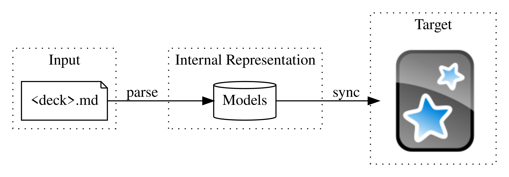

# Anki.md

The markdown format for Anki cards.

## Overview

## Features

- Tools

  - [ ] CLI: md -> deck apkg
  - [ ] CLI: md -> Anki Desktop (via [Anki Connect](https://ankiweb.net/shared/info/2055492159))
  - [ ] Obsidian Integration: md -> Anki Desktop

- Supported Format
  - [ ] Simple front/back card
  - [ ] Custom note types / fields

## Related Projects

- https://github.com/reuseman/flashcards-obsidian, highly inspired by it.
- https://github.com/lukesmurray/markdown-anki-decks
